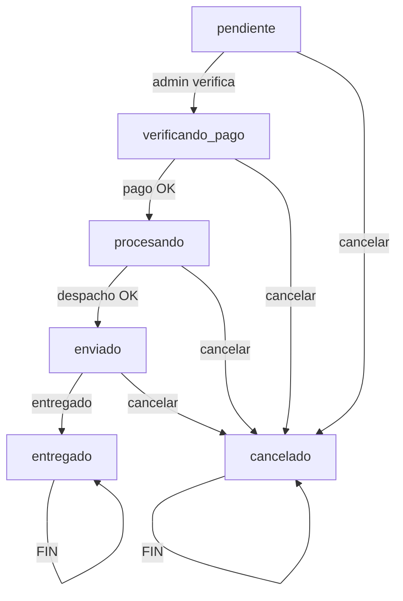
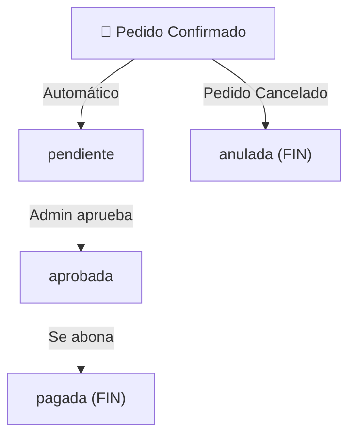
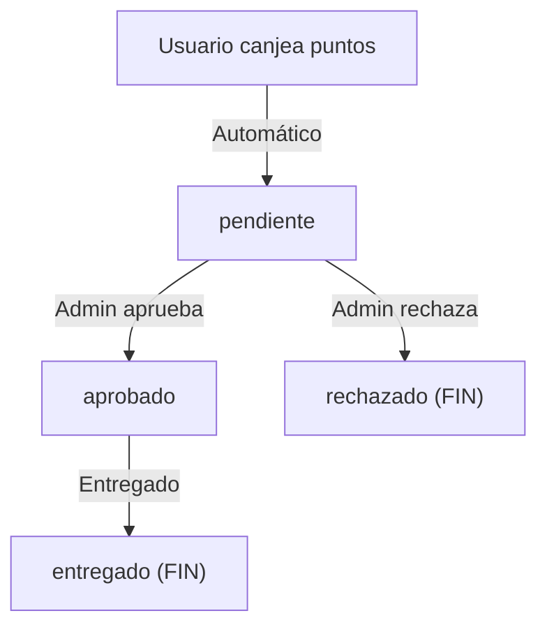

# 📋 Documentación de Enums - Nature Bio Life

**versión:** 1.0.0  
**Última Actualización:** 12 de abril de 2026  
**Propósito:** Guía completa de los enums del sistema para desarrolladores del frontend

---

## 📌 Introducción

Los **enums** (enumeraciones) son valores predefinidos y validados que garantizan integridad relacional en la API. El frontend **debe usar estos valores exactos** al interactuar con los endpoints que los requieren.

### Ubicación en el Código

Todos los enums se encuentran en: `app/Enums/`

---

## 📋 Tabla de Enums

1. [RolUsuarioEnum](#rolusearoienum)
2. [EstadoPedidoEnum](#estadopedidoenum)
3. [EstadoComisionEnum](#estadocomisionenum)
4. [EstadoCanjeEnum](#estadocanjeinenum)

---

# 1️⃣ RolUsuarioEnum

## 📍 Ubicación

`app/Enums/RolUsuarioEnum.php`

## 📝 Descripción

Define los tres roles de usuario disponibles en el sistema. Cada usuario tiene exactamente un rol asignado.

## 🎯 Valores Permitidos

| Valor      | Etiqueta      | Descripción                                        |
| ---------- | ------------- | -------------------------------------------------- |
| `admin`    | Administrador | Acceso completo al sistema, puede crear y eliminar |
| `socio`    | Socio         | Patrocinador, puede ver comisiones de referidos    |
| `vendedor` | Vendedor      | Vendedor regular, acceso limitado a datos propios  |

## 🔗 Dónde se Usa

### 1. En Registros de Usuario

- **Endpoint:** `POST /api/registro`
- **Campo:** Se asigna automáticamente como `'vendedor'`
- **Nota:** El rol no puede modificarse directamente en registro

### 2. En Consultas de Autorización

- Determina permisos para: crear productos, videos, premios
- Controla visibilidad de datos (sus propios vs todos)
- Restringe acceso a endpoints admin

### 3. En Respuestas API

- **Endpoint:** `GET /api/perfil` → incluye campo `"rol"`
- **Endpoint:** `POST /api/login` → incluye campo `"rol"`
- **Endpoint:** `GET /api/referidos` → incluye `"rol"` de cada referido

## 💻 Ejemplos de Uso en Frontend

### Validar Rol Actual

```javascript
const usuarioActual = {
    id: 1,
    nombre: "Juan Pérez",
    rol: "vendedor", // ← Usar estos valores exactos
};

// Verificar si es admin
const esAdmin = usuarioActual.rol === "admin";
const esSocio = usuarioActual.rol === "socio";
const esVendedor = usuarioActual.rol === "vendedor";
```

### Mostrar Etiquetas Legibles

```javascript
const rolLabels = {
    admin: "Administrador",
    socio: "Socio",
    vendedor: "Vendedor",
};

console.log(rolLabels[usuarioActual.rol]); // "Vendedor"
```

### Condicionales de UI

```javascript
{
    esAdmin && <AdminPanel />;
}
{
    esSocio && <ComisionesPanel />;
}
{
    esVendedor && <MisProductosPanel />;
}
```

---

# 2️⃣ EstadoPedidoEnum

## 📍 Ubicación

`app/Enums/EstadoPedidoEnum.php`

## 📝 Descripción

Define el ciclo de vida de un pedido, desde su creación hasta entrega o cancelación. Los cambios de estado están **restringidos**: no todas las transiciones son válidas.

## 🎯 Valores Permitidos

| Valor              | Etiqueta         | Descripción                                      | Es Final |
| ------------------ | ---------------- | ------------------------------------------------ | -------- |
| `pendiente`        | Pendiente        | Cliente creó el pedido, pendiente de comprobante | ❌ No    |
| `verificando_pago` | Verificando Pago | Comprobante subido, admin verifica el pago       | ❌ No    |
| `procesando`       | Procesando       | Pago confirmado, se prepara el despacho          | ❌ No    |
| `enviado`          | Enviado          | Paquete en camino al cliente                     | ❌ No    |
| `entregado`        | Entregado        | Cliente recibió el pedido (FINAL POSITIVO)       | ✅ Sí    |
| `cancelado`        | Cancelado        | Pedido cancelado por admin o cliente (FINAL)     | ✅ Sí    |

## 🔄 Transiciones Permitidas

Las transiciones mostradas abajo son las **únicas válidas**:



**En tabla:**

| Estado Actual      | Puede Cambiar a                   |
| ------------------ | --------------------------------- |
| `pendiente`        | `verificando_pago`, `cancelado`   |
| `verificando_pago` | `procesando`, `cancelado`         |
| `procesando`       | `enviado`, `cancelado`            |
| `enviado`          | `entregado`, `cancelado`          |
| `entregado`        | (Sin transiciones - Estado Final) |
| `cancelado`        | (Sin transiciones - Estado Final) |

## 🔗 Dónde se Usa

### 1. Crear Pedido

- **Endpoint:** `POST /api/pedidos`
- **Campo:** Se asigna automáticamente como `'pendiente'`
- **Quién:** El cliente

### 2. Actualizar Estado

- **Endpoint:** `PATCH /api/pedidos/{id}/estado`
- **Rol Requerido:** Solo Admin
- **Body:** `{ "estado": "procesando" }`
- **Nota:** El backend valida transiciones permitidas; si envías una inválida → error 422

### 3. Listar Pedidos

- **Endpoint:** `GET /api/pedidos`
- **Respuesta:** Cada pedido incluye `"estado"`
- **Filtrado:** Frontend puede filtrar por estado

## 💻 Ejemplos de Uso en Frontend

### Estado Actual de Pedido

```javascript
const pedido = {
    id: 1,
    numero_pedido: "ORD-ABC123",
    estado: "procesando", // ← Usar estos valores exactos
    total: 150.5,
};

// Mostrar color según estado
const colorEstado = {
    pendiente: "#FFA500", // Naranja
    verificando_pago: "#ffb300", // Amarillo
    procesando: "#4169E1", // Azul
    enviado: "#32CD32", // Verde claro
    entregado: "#228B22", // Verde oscuro
    cancelado: "#DC143C", // Rojo
};

console.log(colorEstado[pedido.estado]); // "#4169E1"
```

### Cambiar Estado (Solo Admin)

```javascript
// ✅ Válido: de "procesando" a "enviado"
const cambiarEstado = async (pedidoId, nuevoEstado) => {
    try {
        const res = await fetch(`/api/pedidos/${pedidoId}/estado`, {
            method: "PATCH",
            headers: {
                Authorization: `Bearer ${token}`,
                "Content-Type": "application/json",
            },
            body: JSON.stringify({ estado: nuevoEstado }),
        });
        // El servidor valida que la transición sea permitida
    } catch (error) {
        console.error("Error:", error);
    }
};

// Uso:
cambiarEstado(1, "enviado"); // ✅
cambiarEstado(1, "entregado"); // ❌ Error 422 si está pendiente
```

### Mostrar Progreso del Pedido

```javascript
const pasosEntrega = [
    { estado: "pendiente", label: "Pedido Creado", icono: "📝" },
    { estado: "verificando_pago", label: "Verificando Pago", icono: "🔍" },
    { estado: "procesando", label: "Procesando", icono: "⚙️" },
    { estado: "enviado", label: "En Camino", icono: "📦" },
    { estado: "entregado", label: "Entregado", icono: "✅" },
];

const estadoActual = pedido.estado;
const pasoActual = pasosEntrega.findIndex((p) => p.estado === estadoActual);

pasosEntrega.map((paso, idx) => (
    <div key={paso.estado} className={idx <= pasoActual ? "completado" : ""}>
        {paso.icono} {paso.label}
    </div>
));
```

---

# 3️⃣ EstadoComisionEnum

## 📍 Ubicación

`app/Enums/EstadoComisionEnum.php`

## 📝 Descripción

Gestiona el estado de las comisiones ganadas por vendedores. Las comisiones se generan automáticamente cuando hay un pedido y pasan por un flujo de aprobación.

## 🎯 Valores Permitidos

| Valor       | Etiqueta  | Descripción                                     | Es Final |
| ----------- | --------- | ----------------------------------------------- | -------- |
| `pendiente` | Pendiente | Comisión generada, esperando revisión del admin | ❌ No    |
| `aprobada`  | Aprobada  | Admin aprobó la comisión, lista para pagar      | ❌ No    |
| `pagada`    | Pagada    | Comisión ya fue abonada al vendedor (FINAL)     | ✅ Sí    |
| `anulada`   | Anulada   | Anulada (ej: pedido cancelado) (FINAL)          | ✅ Sí    |

## 🔄 Flujo de Comisiones



## 🔗 Dónde se Usa

### 1. Listar Mis Comisiones

- **Endpoint:** `GET /api/comisiones`
- **Rol Requerido:** Autenticado (usuarios ven sus comisiones, admin ve todas)
- **Respuesta:** Cada comisión incluye `"estado"`

### 2. Ver Comisión Específica

- **Endpoint:** `GET /api/comisiones/{id}`
- **Respuesta:** Incluye `"estado"` actual

### 3. Crear Comisión Manual

- **Endpoint:** `POST /api/comisiones` (Solo Admin)
- **Body:** `{ "estado": "pendiente" }` (se recomienda)

### 4. Actualizar Comisión

- **Endpoint:** `PUT /api/comisiones/{id}` (Solo Admin)
- **Body:** `{ "estado": "pagada" }`

## 💻 Ejemplos de Uso en Frontend

### Dashboard de Comisiones

```javascript
const comisiones = [
    { id: 1, monto: 25.5, estado: "pendiente" },
    { id: 2, monto: 30.0, estado: "aprobada" },
    { id: 3, monto: 45.0, estado: "pagada" },
];

// Agrupar por estado
const agrupadosPorEstado = {
    pendiente: comisiones.filter((c) => c.estado === "pendiente"),
    aprobada: comisiones.filter((c) => c.estado === "aprobada"),
    pagada: comisiones.filter((c) => c.estado === "pagada"),
    anulada: comisiones.filter((c) => c.estado === "anulada"),
};

console.log(`Pendientes: ${agrupadosPorEstado.pendiente.length}`); // 1
```

### Mostrar Icono de Estado

```javascript
const iconoEstadoComision = {
    pendiente: "⏳",
    aprobada: "✓",
    pagada: "💰",
    anulada: "❌",
};

const comision = { id: 1, estado: "aprobada", monto: 25.5 };
console.log(`${iconoEstadoComision[comision.estado]} $${comision.monto}`); // "✓ $25.50"
```

### Totales por Estado

```javascript
const calcularTotalesPorEstado = (comisiones) => {
    const totales = {
        pendiente: 0,
        aprobada: 0,
        pagada: 0,
        anulada: 0,
    };

    comisiones.forEach((c) => {
        totales[c.estado] += c.monto;
    });

    return totales;
};

const totales = calcularTotalesPorEstado(comisiones);
// { pendiente: 25.50, aprobada: 30.00, pagada: 45.00, anulada: 0 }
```

---

# 4️⃣ EstadoCanjeEnum

## 📍 Ubicación

`app/Enums/EstadoCanjeEnum.php`

## 📝 Descripción

Gestiona el estado de las solicitudes de canje de premios. Un usuario intenta canjear puntos por un premio y el canje pasa por un proceso de aprobación.

## 🎯 Valores Permitidos

| Valor       | Etiqueta  | Descripción                                     | Es Final |
| ----------- | --------- | ----------------------------------------------- | -------- |
| `pendiente` | Pendiente | Solicitud de canje recibida, pendiente revisión | ❌ No    |
| `aprobado`  | Aprobado  | Admin aprobó, se prepara la entrega             | ❌ No    |
| `entregado` | Entregado | Premio entregado al usuario (FINAL POSITIVO)    | ✅ Sí    |
| `rechazado` | Rechazado | Solicitud rechazada por admin (FINAL NEGATIVO)  | ✅ Sí    |

## 🔄 Flujo de Canjes



## 🔗 Dónde se Usa

### 1. Crear Canje

- **Endpoint:** `POST /api/canje-premios`
- **Rol Requerido:** Autenticado
- **Body:** `{ "premio_id": 1 }`
- **Asigna automáticamente:** `"estado": "pendiente"`
- **Validación:** Backend valida puntos suficientes

### 2. Listar Mis Canjes

- **Endpoint:** `GET /api/canje-premios`
- **Respuesta:** Cada canje incluye `"estado"`

### 3. Ver Canje Específico

- **Endpoint:** `GET /api/canje-premios/{id}`
- **Respuesta:** Incluye `"estado"` actual

### 4. Actualizar Estado

- **Endpoint:** `PUT /api/canje-premios/{id}` (Solo Admin)
- **Body:** `{ "estado": "aprobado" }`

## 💻 Ejemplos de Uso en Frontend

### Listar Mis Canjes

```javascript
const misCanjes = [
    {
        id: 1,
        premio: { nombre: "Camiseta Oficial" },
        puntos_utilizados: 500,
        estado: "pendiente",
    },
    {
        id: 2,
        premio: { nombre: "Taza" },
        puntos_utilizados: 200,
        estado: "aprobado",
    },
];

// Ver solo los pendientes
const canjesPendientes = misCanjes.filter((c) => c.estado === "pendiente");
console.log(`Canjes en review: ${canjesPendientes.length}`); // 1
```

### Badge de Estado

```javascript
const badgeEstadoCanje = {
    pendiente: { color: "#FFA500", texto: "⏳ En Review" },
    aprobado: { color: "#4169E1", texto: "✓ Aprobado" },
    entregado: { color: "#228B22", texto: "📦 Entregado" },
    rechazado: { color: "#DC143C", texto: "❌ Rechazado" },
};

const canje = misCanjes[0];
const badge = badgeEstadoCanje[canje.estado];
console.log(`${badge.texto}`); // "⏳ En Review"
```

### Crear Canje

```javascript
const crearCanje = async (premioId) => {
    try {
        const res = await fetch("/api/canje-premios", {
            method: "POST",
            headers: {
                Authorization: `Bearer ${token}`,
                "Content-Type": "application/json",
            },
            body: JSON.stringify({ premio_id: premioId }),
        });

        if (res.ok) {
            const nuevoCanje = await res.json();
            // nuevoCanje.estado === 'pendiente'
            console.log("Canje creado:", nuevoCanje);
        } else {
            const error = await res.json();
            // Posibles errores:
            // - "Puntos insuficientes..."
            // - Validación fallida
        }
    } catch (error) {
        console.error("Error al crear canje:", error);
    }
};
```

---

# 🛠️ Resumen de Valores por Campo

## Tabla Rápida: Enums y Sus Valores

| Enum                   | Valores Permitidos                                                                             |
| ---------------------- | ---------------------------------------------------------------------------------------------- |
| **RolUsuarioEnum**     | `'admin'`, `'socio'`, `'vendedor'`                                                             |
| **EstadoPedidoEnum**   | `'pendiente'`, `'verificando_pago'`, `'procesando'`, `'enviado'`, `'entregado'`, `'cancelado'` |
| **EstadoComisionEnum** | `'pendiente'`, `'aprobada'`, `'pagada'`, `'anulada'`                                           |
| **EstadoCanjeEnum**    | `'pendiente'`, `'aprobado'`, `'entregado'`, `'rechazado'`                                      |

---

# 📚 Métodos Disponibles en Enums (Backend)

### Para Desarrolladores Frontend (Referencia):

Aunque estos métodos se usan en el backend, es útil saber que existen:

#### 1. `.label()`

```php
// Backend: EstadoPedidoEnum::PROCESANDO->label() === 'Procesando'
```

Los valores de etiqueta están documentados en esta guía en la columna "Etiqueta".

#### 2. `::valores()`

```php
// Backend: EstadoPedidoEnum::valores()
// Retorna: ['pendiente', 'verificando_pago', 'procesando', ...]
```

Frontend puede usarlos para validaciones y dropdowns.

#### 3. `.transicionesPermitidas()` (Solo EstadoPedidoEnum)

```php
// Backend: EstadoPedidoEnum::PROCESANDO->transicionesPermitidas()
// Retorna: [ENVIADO, CANCELADO]
```

Ver tabla de transiciones en la sección de EstadoPedidoEnum.

---

# ⚠️ Reglas Importantes

## 1. Exactitud de Valores

```javascript
// ✅ CORRECTO
{ "estado": "entregado" }
{ "rol": "vendedor" }
{ "estado": "aprobado" }

// ❌ INCORRECTO
{ "estado": "Entregado" }     // Capital
{ "rol": "Vendedor" }           // Capital
{ "estado": "aprobada" }       // Genérico femenino en lugar de descriptivo
```

## 2. Validación Backend

El servidor **rechazará con 422** cualquier valor no validado:

```json
{
    "message": "The selected estado is invalid.",
    "errors": {
        "estado": ["The selected estado is invalid."]
    }
}
```

## 3. No Modifiques Enums

Los enums están definidos en el backend. El frontend **solo los consume**, no los define.

## 4. Usos Permitidos

- ✅ Filtrar datos por enum
- ✅ Mostrar etiquetas legibles
- ✅ Validar transiciones antes de enviar
- ✅ Grupos/dropdowns de selección
- ❌ No generar nuevos valores
- ❌ No asumir más valores que los documentados

---

# 📞 Soporte y Contacto

¿Encontraste un enum diferente o crees que existe un nuevo caso de uso?

**Pasos:**

1. Verifica que no esté en este documento
2. Revisa `app/Enums/` en el código
3. Consulta con el equipo backend sobre nuevos valores

---

**Última Generación:** 12 de abril de 2026  
**Estado:** ✅ Completa y Validada
